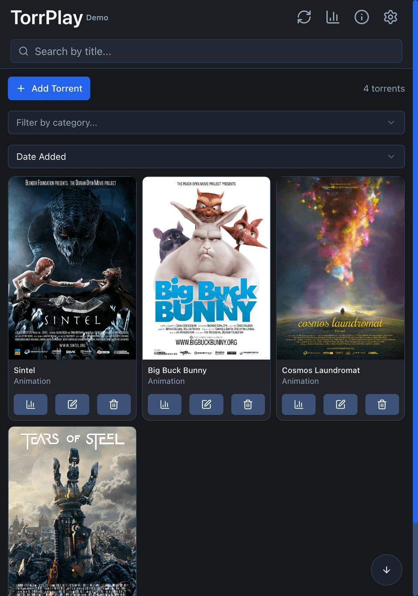
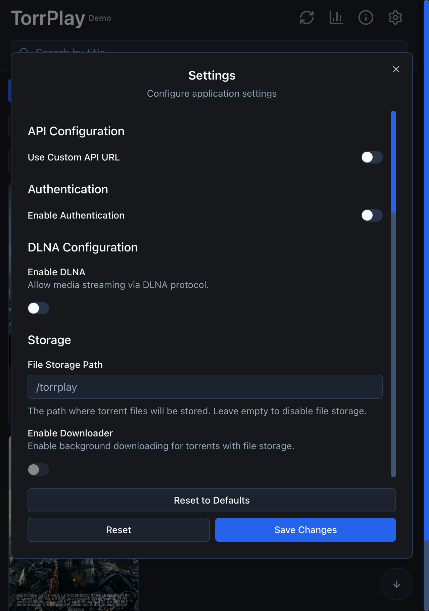

<!--
SPDX-FileCopyrightText: 2026 TorrPlay

SPDX-License-Identifier: MIT
-->

# TorrPlay

[](https://opensource.org/licenses/MIT)
[](https://go.dev/)
[](https://pkg.go.dev/github.com/torrplay/torrplay)
[](https://nextjs.org/)
[](https://github.com/torrplay/torrplay/actions)
[](https://github.com/torrplay/torrplay/releases)
[](https://github.com/torrplay/torrplay/pkgs/container/torrplay)
[](https://github.com/torrplay/torrplay/stargazers)

**Stream torrents instantly. No waiting for downloads.**

[Русская версия](README-ru.md)

TorrPlay is a torrent streaming application with a user-friendly interface. Simply paste a magnet link, pick a video file, and start watching.

<p align="center">
  <a href="docs/main.png"></a>
  <a href="docs/settings.png"></a>
</p>

<p align="center">
  <a href="https://torrplay.github.io">Docs</a> ·
  <a href="https://torrplay.vercel.app/demo">Live Demo</a>
</p>

## Quick Start

```bash
docker run -d \
  --name torrplay \
  -p 8090:8090 \
  -v $(pwd)/data:/app/data \
  --restart unless-stopped \
  ghcr.io/torrplay/torrplay:latest \
  --data-dir /app/data
```

Open `http://localhost:8090` in your browser.

More options: [Download prebuilt binaries](https://torrplay.github.io/download/) · [Running with Docker](https://torrplay.github.io/quick-start/running-with-docker/) · [Building from Source](https://torrplay.github.io/quick-start/building-from-source/)

## Highlights

- **Instant streaming** — watch while downloading
- **Built-in video player** — supports MP4, MKV, WebM and more in the browser
- **Web UI** — filters, sorting and search
- **DLNA** — cast to smart TVs and other devices
- **Mobile** — Android app available
- **qBittorrent API** — works with Prowlarr, Radarr, Sonarr
- **TorrServer compatible** — works with TorrServer clients
- **Dual storage** — RAM or disk
- **Model Context Protocol (MCP)** — control and stream torrents directly via AI assistants (Claude Desktop, Cursor, etc.)

## Links

- [Download](https://torrplay.github.io/download)
- [Releases](https://github.com/torrplay/torrplay/releases)
- [Docs](https://torrplay.github.io/docs)
- [API Reference](https://torrplay.github.io/docs/api)

## License

[MIT](LICENSE)
